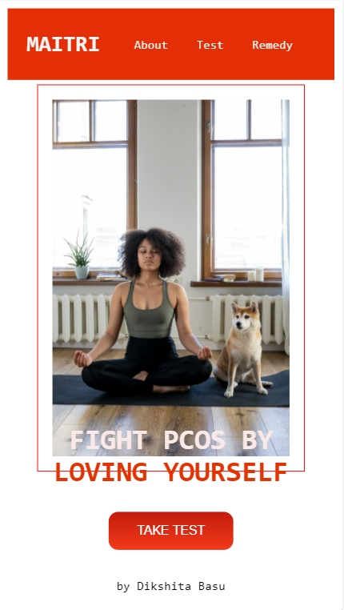
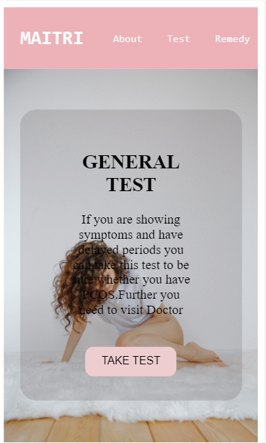
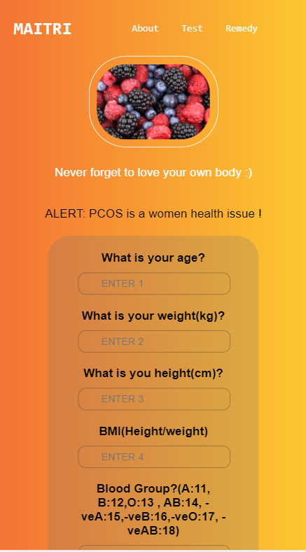
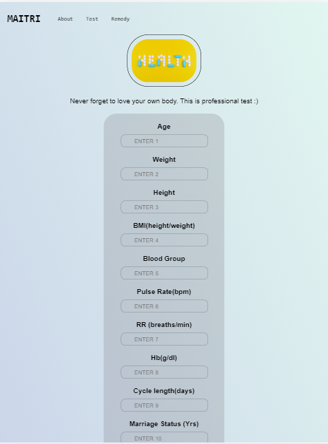

# MAITRI
A project to test, and create awareness about PCOS .

MAITRI helps you diagonise PCOS.50% of the women suffering from PCOS goes undiagonised and it's and alarming helath issue which if not taken care in preliminary stage can also led to cancer.

### What is PCOS ?
Polycystic Ovary Syndrome, or PCOS, is a health condition that affects about 10 million people in the world. The exact cause is unknown, but it is considered a hormonal problem. Genetics and environmental factors are believed to be involved in the development of PCOS. It is a leading cause of female infertility and is responsible for a number of symptoms that can affect the body physically and emotionally.

### LINK to the Website
https://maitri-pcos.herokuapp.com/

### TECH STACK USED
1. Libraries : numpy, pandas, sklearn.
2. Front-end : HTML, CSS
3. Backend : Flask
Deployed using Heroku.
Also I have tried for the first time to deploy 2 models in one program.

### SCREENSHOTS

